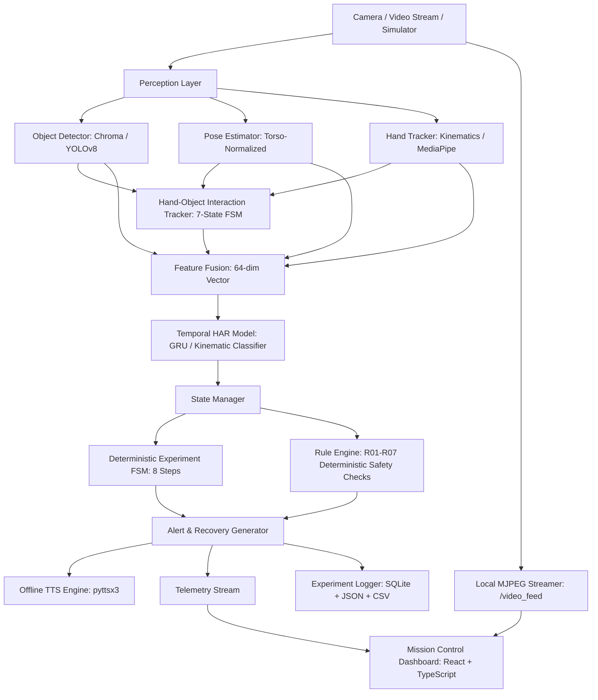

# ORBITA — Offline AI Experiment Copilot for Astronauts
### SIH Problem ID: 26174 — AI Human Activity Recognition for On-Board BAS Experiments

[](https://www.python.org/)
[](https://fastapi.tiangolo.com/)
[](https://react.dev/)
[](https://tailwindcss.com/)
[]()
[](https://www.nvidia.com/en-us/autonomous-machines/embedded-systems/jetson-orin/)

> **Space-aware, offline, intelligent experiment-procedure validation and assistance system for astronauts conducting scientific payloads on space stations (such as Bharatiya Antariksh Station - BAS).**

---

## 🌌 The Problem & Vision

Astronauts on space missions operate complex, delicate scientific experiments in isolated, microgravity environments with strict procedural constraints. Ground control communication experiences transmission latency and blackout periods. 

Standard Human Activity Recognition (HAR) systems merely answer:
> *"What activity is the human performing?"*

**ORBITA goes beyond passive recognition to act as an active, offline copilot:**
> *"What experiment action is being performed, is it valid for the current experiment state, and what should the astronaut do next?"*

---

## 🏛️ System Architecture



---

## ⚡ Core Features

- 🛰️ **100% Offline-First**: Zero cloud dependencies. Runs entirely on local edge hardware (NVIDIA Jetson Orin Nano / local workstation).
- 🛡️ **Deterministic Safety Guarantees**: A formal 8-state Finite State Machine + 7 explicit safety rules (`R01`–`R07`). The procedure **never** advances on errors or uncertainty.
- 👁️ **Space-Aware Perception**:
  - **Torso-Normalized Pose**: Invariant to camera distance, astronaut height, and orientation.
  - **Hybrid Detection**: YOLOv8 with automatic Chroma/HSV fallback when weights are offline.
  - **Temporal Hand-Object Interaction (HOI)**: 7-stage state machine tracking grasp, hold, operate, and release.
- ⏱️ **Temporal HAR**: Dual-head GRU temporal classifier over a 64-dimensional fusion vector across a 30-frame sliding window.
- 🔊 **Offline Voice Copilot**: Non-blocking speech synthesis with debouncing for real-time auditory instructions.
- 🎮 **Zero-Hardware Visual Simulator**: Built-in 2D physics/kinematics simulator generating synthetic workbench scenarios (Nominal, Wrong Object, Step Skipped).
- 📊 **Mission Control HUD**: Dark-space astronaut dashboard showing live stream, procedure timeline, action guidance cards, and recovery alerts.
- 🗄️ **Blackbox Experiment Logging**: Real-time structured records exported to SQLite, JSON, and CSV.

---

## 🚀 Quick Start

See **[HOW_TO_RUN.md](HOW_TO_RUN.md)** for detailed instructions.

```powershell
# 1. Install dependencies
pip install -r requirements.txt

# 2. Run ORBITA in Web Mission Control Mode
python main.py --mode web --scenario A --port 8000

# 3. Open your browser
# http://localhost:8000
```

---

## 🧪 Test Suite

Run the full automated test suite:

```powershell
python -m pytest tests/ -v
```

```
============================= 49 passed in 34.50s =============================
```

---

## 📂 Project Structure

```
ORB/
├── config/
│   └── experiment_config.json    # Decoupled 8-step experiment procedure
├── orbita/
│   ├── app/                      # Central Pydantic configuration
│   ├── perception/               # Object detection, pose estimation, hand tracking
│   ├── interaction/              # Temporal Hand-Object Interaction (HOI) tracker
│   ├── har/                      # 64-dim feature fusion & temporal GRU model
│   ├── reasoning/                # Deterministic FSM, rule engine, state manager
│   ├── voice/                    # Offline TTS engine & template message generator
│   ├── video/                    # Camera capture, MJPEG streamer, MP4 recorder
│   ├── database/                 # SQLite storage layer
│   ├── logging/                  # Experiment event logger (JSON, CSV, SQLite)
│   ├── simulation/               # 2D visual experiment simulator
│   └── backend/                  # FastAPI REST, WebSocket & static file server
├── frontend/                     # React + TypeScript + Tailwind mission control UI
├── tests/                        # 49 end-to-end and unit tests
├── main.py                       # Unified CLI launcher
├── requirements.txt              # Python dependencies
├── HOW_TO_RUN.md                 # Step-by-step setup & execution guide
└── README.md                     # Project overview
```
